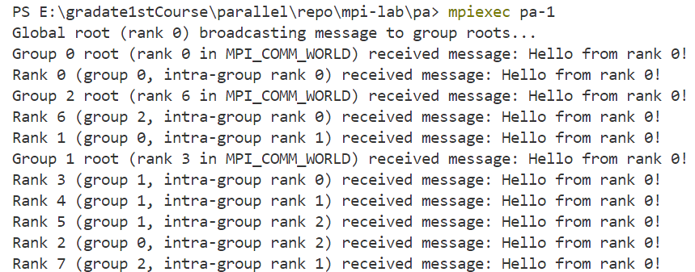
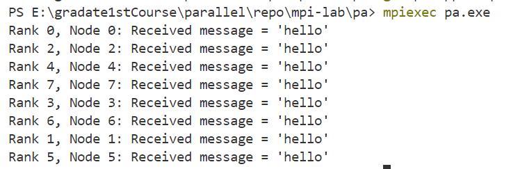
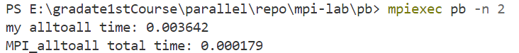
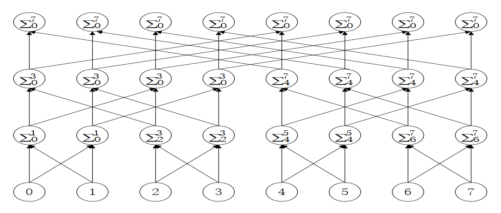
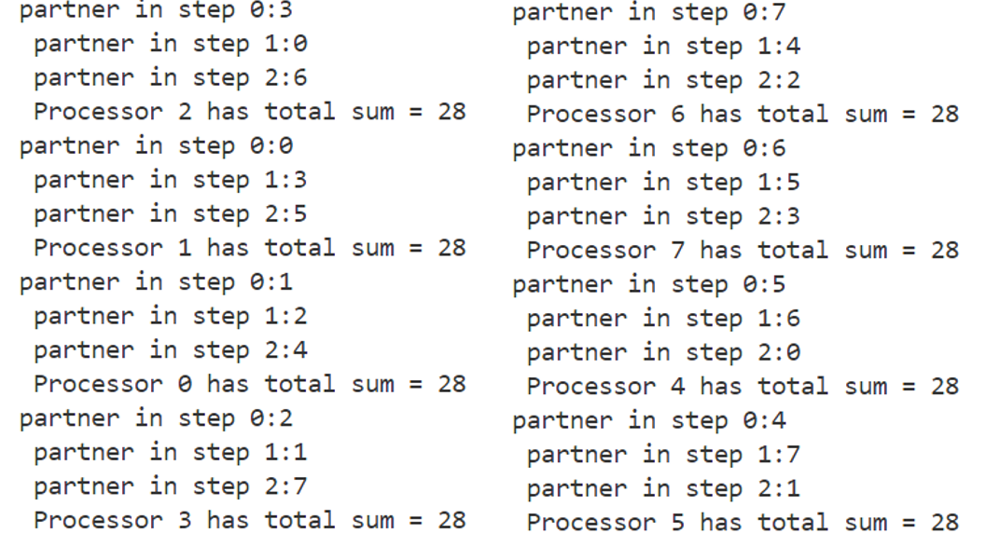
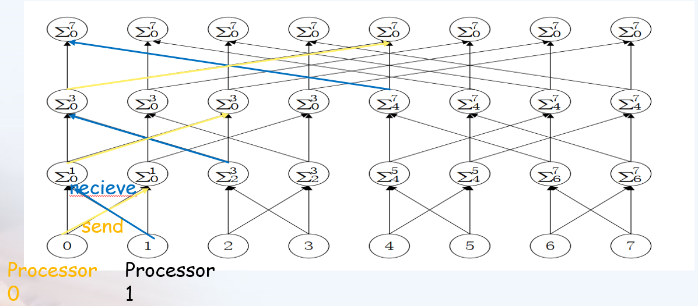
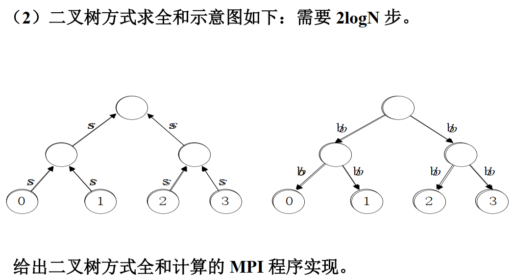
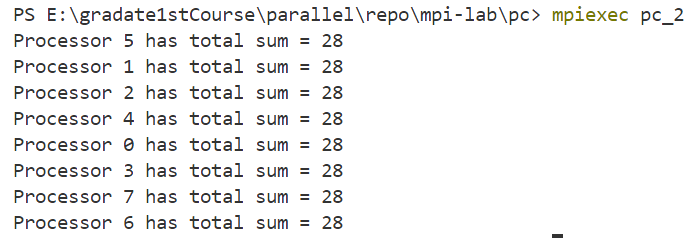

# <center>并行程序设计实验报告</center>

### <center>刘天润SC24219058</center>

# MPI-LAB

## 1 problem a
1.1）写个将 MPI 进程按其所在节点分组的程序;（1.2）在 1.1 的基础
上，写个广播程序，主要思想是：按节点分组后，广播的 root 进程将消息
“发送”给各组的“0 号”，再由这些“0”号进程在其小组内执行 MPI_Bcast.

### （1.1）
使用 MPI_Comm_split 来基于每个进程的节点信息创建新的通信组

```c
#include <stdio.h>
#include <stdlib.h>
#include <mpi.h>
#include <string.h>
#include <winsock2.h>  // 使用Windows上的等效头文件

int main(int argc, char *argv[]) {
    int rank, size, node_id;
    MPI_Comm node_comm;
    int root_rank = 0;  // 假设每个节点的根进程为“0号进程”
    char message[256];

    MPI_Init(&argc, &argv);
    MPI_Comm_rank(MPI_COMM_WORLD, &rank);
    MPI_Comm_size(MPI_COMM_WORLD, &size);

    // 获取节点编号，假设使用的是 SLURM 或其他支持环境变量的系统
    char hostname[256];
    DWORD hostname_len = sizeof(hostname);
    GetComputerNameA(hostname, &hostname_len);  // 使用GetComputerNameA函数替代GetComputerName
    node_id = rank;  

    // 将进程按节点分组
    MPI_Comm_split(MPI_COMM_WORLD, node_id, rank, &node_comm);

    // 输出每个节点中的进程信息
    int node_rank, node_size;
    MPI_Comm_rank(node_comm, &node_rank);
    MPI_Comm_size(node_comm, &node_size);

    if (node_rank == 0) {
        // 每个节点的0号进程设置消息
        snprintf(message, sizeof(message), "Hello from node %d, root %d!", node_id, rank);
        printf("Node %d, Root Rank %d: Message = '%s'\n", node_id, rank, message);
    }

    MPI_Comm_free(&node_comm);
    MPI_Finalize();
    return 0;
}


```
运行结果如下：



### （1.2）
在上面基础上，加入广播功能，使得每个节点的“0 号”进程将消息发送给节点内的所有进程。每个节点内的进程通过 MPI_Bcast 接收消息

```c
 if (node_rank == 0) {
        // 每个节点的0号进程设置消息
        snprintf(message, sizeof(message), "Hello from node %d, root %d!", node_id, rank);
        printf("Node %d, Root Rank %d: Message = '%s'\n", node_id, rank, message);
    }

    // 在每个节点内的进程通过 MPI_Bcast 接收消息
    MPI_Bcast(message, sizeof(message), MPI_CHAR, root_rank, node_comm);

```


## 2 problem b
使用 MPI_Send 和 MPI_Recv 来模拟 MPI_Alltoall。将你的实验与相关 MPI通信函数做评测和对比。

```c
//自定义alltoall函数
void MPI_Alltoall_my(int* senddata, int sendcount, MPI_Datatype senddatatype, int* recvdata, int recvcount,
        MPI_Datatype recvdatatype, MPI_Comm comm) {
        int rank, size;
        MPI_Status status;
        MPI_Comm_rank(comm, &rank);
        MPI_Comm_size(comm, &size);
        //每个进程都会遍历所有进程（包括自己）
        for (int i = 0; i < size; i++) {
            //如果当前进程 i 不是自己（i != rank），则使用 MPI_Send 发送数据到进程 i，并使用 MPI_Recv 从进程 i 接收数据。
            if (i != rank) {
                MPI_Send(senddata + i * sendcount, sendcount, senddatatype, i, rank , comm);
                MPI_Recv(recvdata + i * recvcount, recvcount, recvdatatype, i, i, comm, &status);            
            }
            //如果当前进程 i 是自己（i == rank），则直接将发送缓冲区的数据复制到接收缓冲区。 
            else {
                for (int j = i*sendcount; j < i*sendcount + sendcount; j++) {
                    recvdata[j] = senddata[j];
                }
            }
        }
}
```
对比自定义的Alltoall函数和MPI_Alltoall的性能
```c
int main() {
    int i, rank, datasize;
    datasize = 500;
    int size;
    double start_time, end_time;
    double min_start_time, max_end_time;
    //初始化 MPI 环境，获取当前进程的 rank 和总进程数
    MPI_Init(NULL, NULL);
    MPI_Comm_rank(MPI_COMM_WORLD, &rank);
    MPI_Comm_size(MPI_COMM_WORLD, &size);

    int *send, *recv;
    //分配发送和接收缓冲区，并初始化发送缓冲区的数据。
    send = (int*)malloc(sizeof(int)*datasize*size);
    recv = (int*)malloc(sizeof(int)*datasize*size);
    for (int j = 0; j < datasize*size; j++) {
        send[j] = j+1;
    }

    //测量自定义 MPI_Alltoall_my 函数的执行时间，并输出结果
    start_time = MPI_Wtime();
    MPI_Alltoall_my(send, datasize, MPI_INT, recv, datasize, MPI_INT, MPI_COMM_WORLD);
    end_time = MPI_Wtime();
    MPI_Reduce(&start_time, &min_start_time, 1, MPI_DOUBLE, MPI_MIN, 0, MPI_COMM_WORLD);
    MPI_Reduce(&end_time, &max_end_time, 1, MPI_DOUBLE, MPI_MAX, 0, MPI_COMM_WORLD);
    if (rank == 0) {
        printf("my alltoall time: %f\n", max_end_time - min_start_time);
    }
    //同步所有进程，确保精确测量时间
    MPI_Barrier(MPI_COMM_WORLD);

    //测量MPI_Alltoall函数的执行时间，并输出结果
    start_time = MPI_Wtime();
    MPI_Alltoall(send, datasize, MPI_INT, recv, datasize, MPI_INT, MPI_COMM_WORLD);
    end_time = MPI_Wtime();
    MPI_Reduce(&start_time, &min_start_time, 1, MPI_DOUBLE, MPI_MIN, 0, MPI_COMM_WORLD);
    MPI_Reduce(&end_time, &max_end_time, 1, MPI_DOUBLE, MPI_MAX, 0, MPI_COMM_WORLD);

    if (rank == 0)
    {
        printf("MPI_alltoall total time: %f\n", max_end_time - min_start_time);
    }
    MPI_Finalize();
}
```
运行结果如下：

设置不同的进程数多次实验，得到性能加速图表如下：

| 进程数| 2  |4     |6     |     8|
|---|   ---|    ---|    ---|    ---|
|my |0.003642|0.008050|0.005132|0.007585
|mpi|0.000179|0.000271|0.000095|0.000108
|加速比|20.3|29.7|54.0|70.2

由上表可得，用MPI在进程间进行多对多通信时，直接用MPI_Send和MPI_Recv函数虽能实现基本功能，但耗费的时间非常多，效率显著低于MPI自带的方法MPI_Alltoall。加速比为模拟Alltoall的时间除以使用MPI_Alltoall的时间，由上表，随着互相通信的进程数增加，使用MPI_Alltoall的加速比会越来越大。

## 3 problem c
N 个处理器求 N 个数的全和，要求每个处理器均保持全和。

### （1） 
蝶式全和的示意图如下： 由于使用了重复计算，共需 logN 步。给出蝶式全和计算的 MPI 程序实现（设 N 为 2 的幂次方）。

```c
int main(int argc, char *argv[]) {
    int rank, size, step, partner;
    int local_value, received_value;

    MPI_Init(&argc, &argv);
    MPI_Comm_rank(MPI_COMM_WORLD, &rank);
    MPI_Comm_size(MPI_COMM_WORLD, &size);

    // 假设每个处理器持有的初始值是其 rank
    // 即计算0+1+2+3+4+5+6+7
    local_value = rank;

    // 蝶式全和过程 (logN 步)
    //每个处理器都发送消息给partner并接受来自partner的消息
    for (step = 0; step < (int)(log2(size)); step++) {
        partner = rank ^ (1 << step);  // 计算通信的处理器partner，编号相差 2的step次方的处理器会进行通信。分别跟0001,0010,0100异或
        printf("partner in step %d:%d\n ",step,partner);
        MPI_Sendrecv(&local_value, 1, MPI_INT, partner, 0, 
                     &received_value, 1, MPI_INT, partner, 0, 
                     MPI_COMM_WORLD, MPI_STATUS_IGNORE);

        // 更新处理器存储的值
        local_value += received_value;
    }

    // 每个处理器都有全和结果
    printf("Processor %d has total sum = %d\n", rank, local_value);

    MPI_Finalize();
    return 0;
}

```
运行结果：



解题说明：
1. 使用MPI_Sendrecv函数，每个处理器都发送消息给partner并接受来自partner的消息。下图以处理器processor 0为例，描述处理器在整个过程中的消息传递操作
   
2. 计算通信的处理器partner：根据蝶形运算的规律，编号相差 $2^{step}$的处理器会进行通信。可以通过异或操作实现，每个处理器分别跟0001,0010,0100异或。例如第1个处理器0001，异或的结果是0，0011，0101，即0，3，5。
   
### （2）

```c
int main(int argc, char *argv[]) {
    int rank, size, step;
    int local_value, received_value;

    MPI_Init(&argc, &argv);
    MPI_Comm_rank(MPI_COMM_WORLD, &rank);
    MPI_Comm_size(MPI_COMM_WORLD, &size);

    // 假设每个处理器持有的初始值是其 rank
    local_value = rank;

    // 向上汇聚阶段 (logN 步)
    for (step = 1; step < size; step *= 2) {
        if (rank % (2 * step) == 0) {
            // 当前节点收集来自子节点的数据
            MPI_Recv(&received_value, 1, MPI_INT, rank + step, 0, MPI_COMM_WORLD, MPI_STATUS_IGNORE);
            local_value += received_value;
        } else if (rank % step == 0) {
            // 当前节点将数据发送给父节点
            MPI_Send(&local_value, 1, MPI_INT, rank - step, 0, MPI_COMM_WORLD);
            break;  // 子节点任务完成，退出
        }
    }

    // 向下广播阶段 (logN 步)
    for (step = size / 2; step >= 1; step /= 2) {
        if (rank % (2 * step) == 0) {
            // 当前节点向子节点发送数据
            MPI_Send(&local_value, 1, MPI_INT, rank + step, 0, MPI_COMM_WORLD);
        } else if (rank % step == 0) {
            // 当前节点接收来自父节点的数据
            MPI_Recv(&local_value, 1, MPI_INT, rank - step, 0, MPI_COMM_WORLD, MPI_STATUS_IGNORE);
        }
    }
    // 每个处理器都有全和结果
    printf("Processor %d has total sum = %d\n", rank, local_value);

    MPI_Finalize();
    return 0;
}
```
运行结果

解题说明：
1. 由题图，二叉树求和的方法：在每一步选择一个处理器储存求和的结果，向上传递汇总到一个处理器，再由这个处理器将求和结果依次传递给剩余处理器。两个过程分别需要$logN$步，故一共$2logN$。
2. 与碟式运算相比，除了第一步所有处理器发送数据外，不是所有处理器参与计算。处理器每次也不是和同一个处理器通信，而是接受子节点数据并发送数据给父节点处理器，因此需要分别使用MPI_Send和MPI_Recv通信。