# <center>并行程序设计实验报告</center>

### <center>刘天润SC24219058</center>

# MPI-LAB

## 1 problem a
1.1）写个将 MPI 进程按其所在节点分组的程序;（1.2）在 1.1 的基础
上，写个广播程序，主要思想是：按节点分组后，广播的 root 进程将消息
“发送”给各组的“0 号”，再由这些“0”号进程在其小组内执行 MPI_Bcast。

解答过程的抽象如下：


### （1.1）进程分组
实验环境只有一个节点，在此直接使用 MPI_Comm_split 创建新的通信组。__MPI_Comm_split__ 的用法如下：
`MPI_Comm_split(MyWorld,Color,Key,&SplitWorld)`函数调用则在通信域MyWorld的基础上产生了几个分割的子通信域。原通信域MyWorld中的进程按照不同的Color值处在不同的分割通信域中，每个进程在不同分割通信域中的进程编号则由Key值来标识

```c
#define GROUP_SIZE 3 // 每组的大小

int main(int argc, char *argv[]) {
    int rank, size;
    MPI_Init(&argc, &argv);
    MPI_Comm_rank(MPI_COMM_WORLD, &rank); 
    MPI_Comm_size(MPI_COMM_WORLD, &size); 

    // 确定有多少组
    int num_groups = (size + GROUP_SIZE - 1) / GROUP_SIZE; // 计算组数（向上取整）

    // 确定当前进程所属的组和组内的 rank
    int group_id = rank / GROUP_SIZE;  
    int intra_group_rank = rank % GROUP_SIZE; 
    // 创建组内通信子
    MPI_Comm group_comm;
    MPI_Comm_split(MPI_COMM_WORLD, group_id, rank, &group_comm);

    // 获取组内 rank 和 size
    int group_rank, group_size;
    MPI_Comm_rank(group_comm, &group_rank);
    MPI_Comm_size(group_comm, &group_size);
```

### （1.2）分层广播

```c
    char message[50]; // 用于存储广播的消息
    int global_bcast_root = 0;

    // 全局 root 进程（rank 0）准备广播消息
    if (rank == global_bcast_root) {
        snprintf(message, sizeof(message), "Hello from rank 0!");
        printf("Global root (rank 0) broadcasting message to group roots...\n");

        // 非阻塞发送消息到每组的 root
        for (int i = 0; i < num_groups; i++) {
            int group_root_rank = i * GROUP_SIZE; // 每组的 root（组内 rank 0）在 MPI_COMM_WORLD 的 rank
            if (group_root_rank < size) { // 确保组存在
                MPI_Request request;
                MPI_Isend(message, sizeof(message), MPI_CHAR, group_root_rank, 0, MPI_COMM_WORLD, &request);
                MPI_Request_free(&request); // 释放请求，非阻塞发送不会阻塞全局 root
            }
        }
    }

    // 各组的 root (组内 rank 0) 接收消息
    if (intra_group_rank == 0) {
        MPI_Recv(message, sizeof(message), MPI_CHAR, global_bcast_root, 0, MPI_COMM_WORLD, MPI_STATUS_IGNORE);
        printf("Group %d root (rank %d in MPI_COMM_WORLD) received message: %s\n", group_id, rank, message);
    }

    // 组内广播消息
    MPI_Bcast(message, sizeof(message), MPI_CHAR, 0, group_comm);

    // 每个进程输出接收的消息
    printf("Rank %d (group %d, intra-group rank %d) received message: %s\n",
           rank, group_id, intra_group_rank, message);

    MPI_Comm_free(&group_comm);

    MPI_Finalize();
    return 0;
```
运行结果如下：


注意这里要用 __非阻塞发送 (MPI_Isend)__ ，否则会造成死锁：
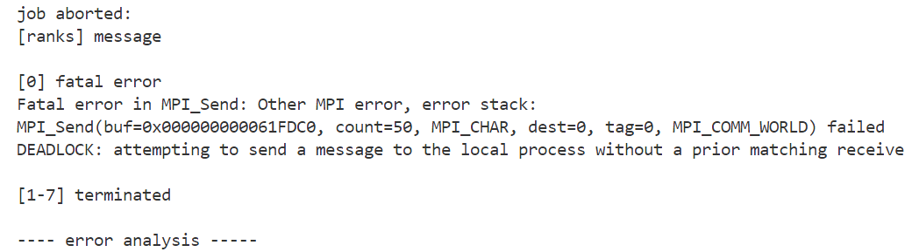

__原因分析：__ 全局 root 进程 (rank 0) 使用 MPI_Send 向每组的 root 发送消息，但是如果接收方（组内的 rank 0）没有准备好调用 MPI_Recv，发送方会阻塞等待，从而导致死锁。
使用 MPI_Isend 替代阻塞的 MPI_Send，并释放请求对象 (MPI_Request_free),
可以避免全局 root 进程等待接收方就绪的情况下发生死锁。(但是不让rank0给rank0发消息虽然不会死锁，但程序也会运行不了？：

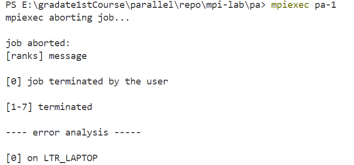

## 2 problem b
使用 MPI_Send 和 MPI_Recv 来模拟 MPI_Alltoall。将你的实验与相关 MPI通信函数做评测和对比。

### 方法一
第一种自定义的MPI_Alltoall函数，算法抽象如下：

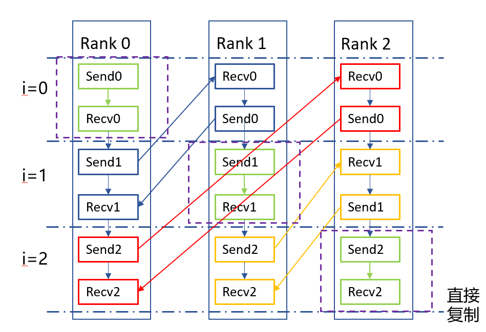

每个进程都会遍历所有进程（包括自己），如果当前进程 i 不是自己（i != rank），则使用 MPI_Send 发送数据到进程 i，并使用 MPI_Recv 从进程 i 接收数据。

```c
//自定义alltoall函数
void MPI_Alltoall_my(int* senddata, int sendcount, MPI_Datatype senddatatype, int* recvdata, int recvcount,
        MPI_Datatype recvdatatype, MPI_Comm comm) {
        int rank, size;
        MPI_Status status;
        MPI_Comm_rank(comm, &rank);
        MPI_Comm_size(comm, &size);
        //每个进程都会遍历所有进程
        for (int i = 0; i < size; i++) {
            //如果当前进程 i 不是自己（i != rank），则使用 MPI_Send 发送数据到进程 i，并使用 MPI_Recv 从进程 i 接收数据。
            if (i != rank) {
                MPI_Send(senddata + i * sendcount, sendcount, senddatatype, i, rank , comm);
                MPI_Recv(recvdata + i * recvcount, recvcount, recvdatatype, i, i, comm, &status);            
            }
            //如果当前进程 i 是自己（i == rank），则直接将发送缓冲区的数据复制到接收缓冲区。 
            else {
                for (int j = i*sendcount; j < i*sendcount + sendcount; j++) {
                    recvdata[j] = senddata[j];
                }
            }
        }
}
```
对比自定义的Alltoall函数和MPI_Alltoall的性能
```c
int main() {
    int i, rank, datasize;
    datasize = 500;
    int size;
    double start_time, end_time;
    double min_start_time, max_end_time;
    //初始化 MPI 环境，获取当前进程的 rank 和总进程数
    MPI_Init(NULL, NULL);
    MPI_Comm_rank(MPI_COMM_WORLD, &rank);
    MPI_Comm_size(MPI_COMM_WORLD, &size);

    int *send, *recv;
    //分配发送和接收缓冲区，并初始化发送缓冲区的数据。
    send = (int*)malloc(sizeof(int)*datasize*size);
    recv = (int*)malloc(sizeof(int)*datasize*size);
    for (int j = 0; j < datasize*size; j++) {
        send[j] = j+1;
    }

    //测量自定义 MPI_Alltoall_my 函数的执行时间，并输出结果
    start_time = MPI_Wtime();
    MPI_Alltoall_my(send, datasize, MPI_INT, recv, datasize, MPI_INT, MPI_COMM_WORLD);
    end_time = MPI_Wtime();
    MPI_Reduce(&start_time, &min_start_time, 1, MPI_DOUBLE, MPI_MIN, 0, MPI_COMM_WORLD);
    MPI_Reduce(&end_time, &max_end_time, 1, MPI_DOUBLE, MPI_MAX, 0, MPI_COMM_WORLD);
    if (rank == 0) {
        printf("my alltoall time: %f\n", max_end_time - min_start_time);
    }
    //同步所有进程，确保精确测量时间
    MPI_Barrier(MPI_COMM_WORLD);

    //测量MPI_Alltoall函数的执行时间，并输出结果
    start_time = MPI_Wtime();
    MPI_Alltoall(send, datasize, MPI_INT, recv, datasize, MPI_INT, MPI_COMM_WORLD);
    end_time = MPI_Wtime();
    MPI_Reduce(&start_time, &min_start_time, 1, MPI_DOUBLE, MPI_MIN, 0, MPI_COMM_WORLD);
    MPI_Reduce(&end_time, &max_end_time, 1, MPI_DOUBLE, MPI_MAX, 0, MPI_COMM_WORLD);

    if (rank == 0)
    {
        printf("MPI_alltoall total time: %f\n", max_end_time - min_start_time);
    }
    MPI_Finalize();
}
```
运行结果如下：


设置不同的进程数多次实验，得到性能加速图表如下：

| 进程数| 2  |4     |6     |     8|
|---|   ---|    ---|    ---|    ---|
|my |0.003642|0.008050|0.005132|0.007585
|mpi|0.000179|0.000271|0.000095|0.000108
|加速比|20.3|29.7|54.0|70.2

由上表可得，用MPI在进程间进行多对多通信时，直接用MPI_Send和MPI_Recv函数虽能实现基本功能，但耗费的时间非常多，效率显著低于MPI自带的方法MPI_Alltoall。加速比为模拟Alltoall的时间除以使用MPI_Alltoall的时间，由上表，随着互相通信的进程数增加，使用MPI_Alltoall的加速比会越来越大。

### 方法二
上述基于两层循环、进程间逐个send和recv的基础实现耗费时间较多，下面对其进行并行优化。
```c
void tony_ladd_alltoall(int *send_data, int *recv_data, int size, int rank) {
    int *buffer = (int *)malloc(size * sizeof(int)); // 缓存用于环形交换

    for (int step = 0; step < size; step++) {
        // 计算发送和接收的目标进程
        int send_to = (rank + step) % size;
        int recv_from = (rank - step + size) % size;

        if (step == 0) {
            // 第一步直接拷贝自己的数据，无需通信
            for (int i = 0; i < size; i++) {
                buffer[i] = send_data[i];
            }
        } else {
            // 环形发送和接收
            MPI_Sendrecv(buffer, size, MPI_INT, send_to, 0,
                         recv_data, size, MPI_INT, recv_from, 0,
                         MPI_COMM_WORLD, MPI_STATUS_IGNORE);

            // 更新缓存为接收到的数据
            for (int i = 0; i < size; i++) {
                buffer[i] = recv_data[i];
            }
        }
    }
    free(buffer);
}
```
运行结果如下：

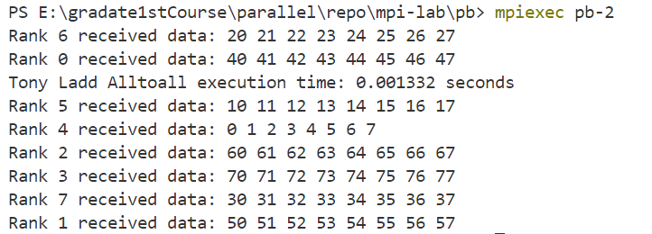

设置不同进程数，画出性能比较图如下：

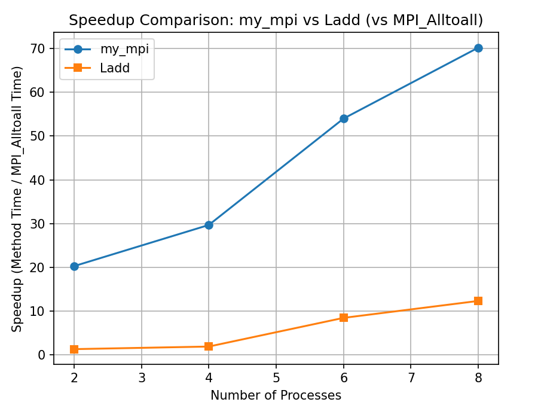

由图，优化后的方法二可以显著降低全局通信alltoall的时间，比第一种方法提升了近10倍。方法二在进程数小于等于4时性能逼近MPI_Alltoall函数，当进程数较大时和MPI_Alltoall仍有较大差距。

## 3 problem c
N 个处理器求 N 个数的全和，要求每个处理器均保持全和。

### （1） 
蝶式全和的示意图如下： 由于使用了重复计算，共需 logN 步。给出蝶式全和计算的 MPI 程序实现（设 N 为 2 的幂次方）。

```c
int main(int argc, char *argv[]) {
    int rank, size, step, partner;
    int local_value, received_value;

    MPI_Init(&argc, &argv);
    MPI_Comm_rank(MPI_COMM_WORLD, &rank);
    MPI_Comm_size(MPI_COMM_WORLD, &size);

    // 假设每个处理器持有的初始值是其 rank
    // 即计算0+1+2+3+4+5+6+7
    local_value = rank;

    // 蝶式全和过程 (logN 步)
    //每个处理器都发送消息给partner并接受来自partner的消息
    for (step = 0; step < (int)(log2(size)); step++) {
        partner = rank ^ (1 << step);  // 计算通信的处理器partner，编号相差 2的step次方的处理器会进行通信。分别跟0001,0010,0100异或
        printf("partner in step %d:%d\n ",step,partner);
        MPI_Sendrecv(&local_value, 1, MPI_INT, partner, 0, 
                     &received_value, 1, MPI_INT, partner, 0, 
                     MPI_COMM_WORLD, MPI_STATUS_IGNORE);

        // 更新处理器存储的值
        local_value += received_value;
    }

    // 每个处理器都有全和结果
    printf("Processor %d has total sum = %d\n", rank, local_value);

    MPI_Finalize();
    return 0;
}

```
运行结果：


解题说明：
1. 使用MPI_Sendrecv函数，每个处理器都发送消息给partner并接受来自partner的消息。下图以处理器processor 0为例，描述处理器在整个过程中的消息传递操作
   
2. 计算通信的处理器partner：根据蝶形运算的规律，编号相差 $2^{step}$的处理器会进行通信。可以通过异或操作实现，每个处理器分别跟0001,0010,0100异或。例如第1个处理器0001，异或的结果是0，0011，0101，即0，3，5。
   
### （2）

```c
int main(int argc, char *argv[]) {
    int rank, size, step;
    int local_value, received_value;

    MPI_Init(&argc, &argv);
    MPI_Comm_rank(MPI_COMM_WORLD, &rank);
    MPI_Comm_size(MPI_COMM_WORLD, &size);

    // 假设每个处理器持有的初始值是其 rank
    local_value = rank;

    // 向上汇聚阶段 (logN 步)
    for (step = 1; step < size; step *= 2) {
        if (rank % (2 * step) == 0) {
            // 当前节点收集来自子节点的数据
            MPI_Recv(&received_value, 1, MPI_INT, rank + step, 0, MPI_COMM_WORLD, MPI_STATUS_IGNORE);
            local_value += received_value;
        } else if (rank % step == 0) {
            // 当前节点将数据发送给父节点
            MPI_Send(&local_value, 1, MPI_INT, rank - step, 0, MPI_COMM_WORLD);
            break;  // 子节点任务完成，退出
        }
    }

    // 向下广播阶段 (logN 步)
    for (step = size / 2; step >= 1; step /= 2) {
        if (rank % (2 * step) == 0) {
            // 当前节点向子节点发送数据
            MPI_Send(&local_value, 1, MPI_INT, rank + step, 0, MPI_COMM_WORLD);
        } else if (rank % step == 0) {
            // 当前节点接收来自父节点的数据
            MPI_Recv(&local_value, 1, MPI_INT, rank - step, 0, MPI_COMM_WORLD, MPI_STATUS_IGNORE);
        }
    }
    // 每个处理器都有全和结果
    printf("Processor %d has total sum = %d\n", rank, local_value);

    MPI_Finalize();
    return 0;
}
```
运行结果

解题说明：
1. 由题图，二叉树求和的方法：在每一步选择一个处理器储存求和的结果，向上传递汇总到一个处理器，再由这个处理器将求和结果依次传递给剩余处理器。两个过程分别需要$logN$步，故一共$2logN$。
2. 与碟式运算相比，除了第一步所有处理器发送数据外，不是所有处理器参与计算。处理器每次也不是和同一个处理器通信，而是接受子节点数据并发送数据给父节点处理器，因此需要分别使用MPI_Send和MPI_Recv通信。

## 4 problem d
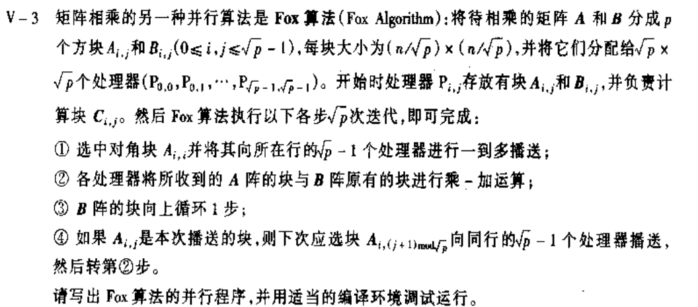

将矩阵进行划分以后，可以按照高等代数里的知识计算
$$
\begin{aligned}
C_{ij} &= \sum_{k=0}^{q-1}A_{ik}B_{kj}\\
&= A_{i0}B_{0j}+A_{il}B_{1j}+\ldots+A_{i,q-1}B_{q-1,j} 
\end{aligned}
$$

但分析上述过程，会发生 __数据访问冲突__：
如下图所示，在进行第一次的计算时，如果按行优先的计算原则，
那么 A00 必然会 R-R 冲突，而 B 矩阵的读取不会发生冲突。同理对角线上的矩阵块都存在访问冲突，因此规避 A 子矩阵的冲突时必然要做的事情，fox算法就是用行通信子将A00广播给每一行的 C0j来解决此问题。

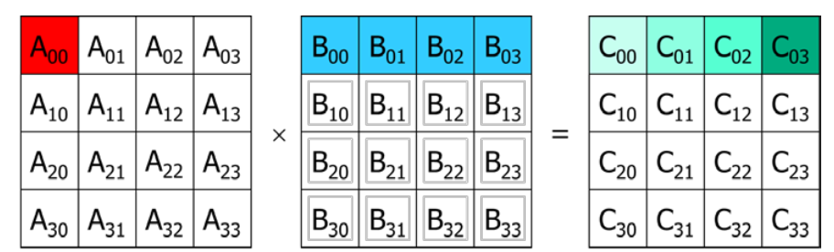

根据题述fox算法的原理，可视化计算过程如下（由于我的电脑CPU只有8线程，下以分块数量block=4为例）：

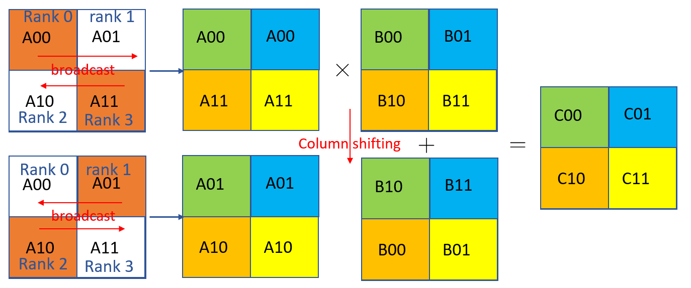

如上图，不同色块表示不同线程/处理器，处理器同时存储划分的子块$A_{ij}$和$B_{ij}$。相乘表示所有处理器同时计算$A_{ij}\times B_{ij}$，并存储点乘的结果$C_{ij}$。

算法实现如下：
```c
int main(int argc, char *argv[])
{
int rank;
int row,column,rowRank,columnRank;
int a[m][m],b[m][m],c[m][m],buffer[m][m];
double begintime,endtime;
begintime=clock();

MPI_Init(&argc, &argv);
MPI_Status(status);
MPI_Comm rowComm,columnComm;
MPI_Comm_rank(MPI_COMM_WORLD, &rank);

row=rank/q;
column=rank%q;

MPI_Comm_split(MPI_COMM_WORLD,row,column,&rowComm);//行子通信域，每次迭代对矩阵A块MPI_Bcast广播

MPI_Comm_split(MPI_COMM_WORLD,column,row,&columnComm);//列子通信域，将矩阵B块MPI_Send发送给上一个线程，并MPI_Recv接收来自下一个线程的B块

MPI_Barrier(MPI_COMM_WORLD);
MPI_Comm_rank(rowComm,&rowRank);
MPI_Comm_rank(columnComm,&columnRank);

for (int i=0;i<m;i++){
  for (int j=0;j<m;j++){
    a[i][j]=(row*m+i)*n+column*m+j;
    b[i][j]=(row*m+i)*n+column*m+j;
    c[i][j]=0;
  }
}

for(int k=0;k<q;k++){
  if (column==(row+k)%q){
    copy(a,buffer);
  }
  MPI_Bcast(buffer,m*m,MPI_INT,(row+k)%q,rowComm);
  Mutply(buffer,b,c);
  copy(b,buffer);
  MPI_Send(buffer,m*m,MPI_INT,(columnRank-1+q)%q,1,columnComm);
  MPI_Recv(b,m*m,MPI_INT,(columnRank+1)%q,1,columnComm,&status);
  MPI_Barrier(MPI_COMM_WORLD);
}
printf("Proccess:%d\n",rank);
for(int i=0;i<m;i++){
  for(int j=0;j<m;j++){
    printf("%d\t",c[i][j]);
  }
  printf("\n");
}
MPI_Barrier(MPI_COMM_WORLD);

```
受江胜同学分享的启发，可以在每一行线程和每一列线程分别划分子通信域，在子通信域内进行通信，方便代码编写，提升执行效率。

运行结果如下：

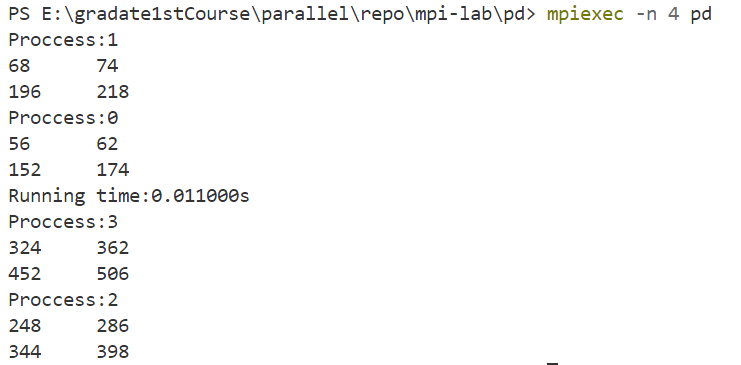

和以下串行执行的结果对比可知，计算结果正确。

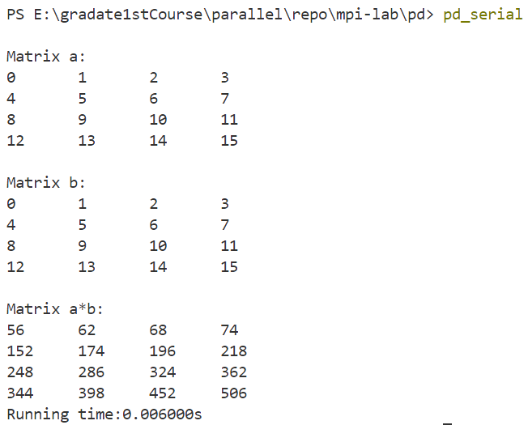

### 5 problem e
根据题述用MPI实现互动过程，算法的抽象如下。我的CPU共有8个线程，设置前2个线程为参数处理器，剩下的6个为工作处理器。

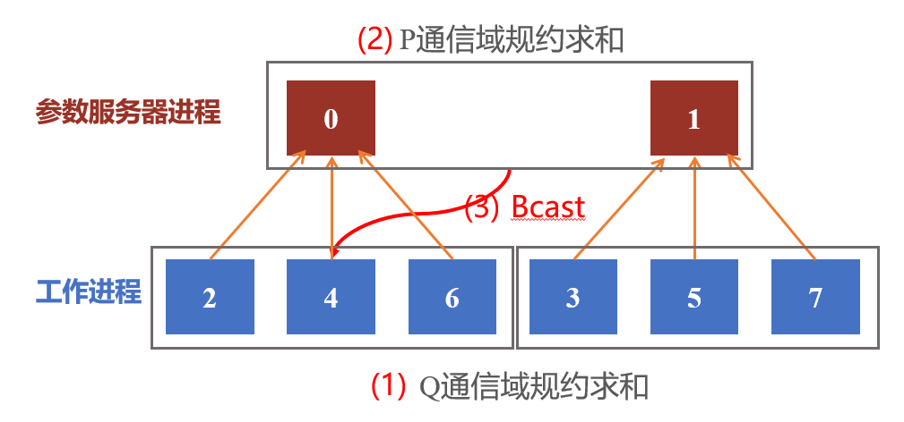

```c
int main( int argc, char* argv[] ){
    int P=2;  //2个参数服务器进程
    int Q =6; //6个工作进程
    int rank, size;
    int senddate=0,sum=0,allsum=0;
    double average=0.0;
    double collect[10];
    int count=2;  //展示两轮互动过程
 
    MPI_Init( &argc, &argv );
    MPI_Status(status);
    MPI_Comm_size( MPI_COMM_WORLD, &size );
    MPI_Comm_rank( MPI_COMM_WORLD, &rank );

    MPI_Comm Pcomm,Qcomm;
   //参数服务器组成子通信域Pcomm
    MPI_Comm_split(MPI_COMM_WORLD,rank/P,rank%P,&Pcomm); 
   //每个参数服务器与其对应的所有工作进程组成一个子通信域Qcomm
    MPI_Comm_split(MPI_COMM_WORLD,rank%P,rank/P,&Qcomm);
    //注意初始化随机数种子。time(NULL) 获取当前时间，rank 确保每个进程有不同的种子
    srand(time(NULL) + rank);
    for(int i=0;i<count;i++){
    if(rank>P-1){
         senddate=rand()%100;
         printf("process%d random%d:  %d\n",rank,i+1,senddate);
    }
//参数服务器对其对应工作进程产生的随机数进行求和归约
    MPI_Reduce(&senddate,&sum,1,MPI_INT,MPI_SUM,0,Qcomm); 
 //参数服务器间求和归约（每个都持有全和）
    MPI_Allreduce(&sum,&allsum,1,MPI_INT,MPI_SUM,Pcomm);
    average=(double)allsum/Q; //注意此处求均值是除以工作进程的数量
 //参数服务器将平均值广播给对应的工作进程
    MPI_Bcast(&average,1,MPI_DOUBLE,0,Qcomm);
    collect[i]=average;
    }

//结束输出平均值
    MPI_Barrier(MPI_COMM_WORLD);
    printf("process:%d average number:\t",rank);
    for(int i=0;i<count;i++){
      printf("%f\t",collect[i]);
    }
   printf("\n");
    MPI_Finalize();
    return 0;
}
```
运行结果如下：

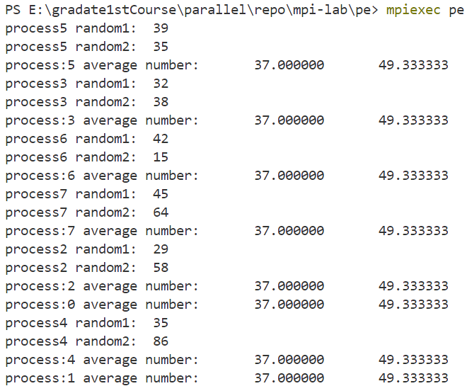

如图，每个进程都获得了所有工作进程的平均值，以第一轮为例，程序计算的结果为37，由average=(39 + 32 + 42 + 45 + 29 + 35 )/6=37可知计算正确。